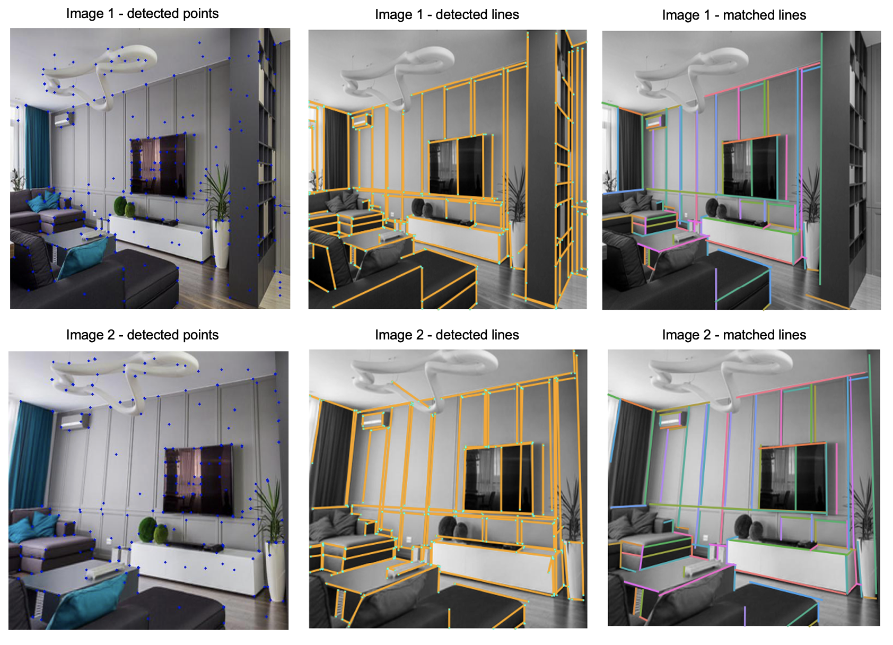
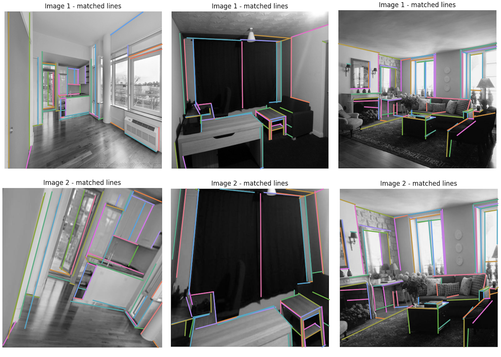

# Joint-PL - Joint point and line detection and description

This repository contains the implementation of the project: Joint-PL - Joint point and line detection and description. This project is conducted as ETH Zürich Master Semester Project under the supervision of 
[Rémi Pautrat](https://github.com/rpautrat).

Joint-PL is the <b>first</b> deep network for joint line and point detection and
description. In this work, we innovatively construct point and line
descriptor based on the <b>shared dense description map</b>. The proposed model achieves a <b>reasonable
performance margin</b> compared to the state-of-the-art with <b>less inference
time</b>.  

## Demos

Point detection, line detection and matching:


Line matching under extreme viewpoint and scale changes:


## Usage

### Installation

We recommend using this code in a Python environment (e.g. venv or conda). The following script installs the necessary requirements with pip:
```bash
pip install -r requirements.txt
```

Set your dataset and experiment paths by modifying the variables "EXPER_PATH" and "DATA_PATH" in the file `JointPL/settings.py`.

Install the Python package:
```bash
pip install -e .
```

### Dataset

We used the processed [Wireframe dataset](https://github.com/huangkuns/wireframe) in the [F-Clip work](https://github.com/Delay-Xili/F-Clip) to train and test our model. You can download this dataset from this [link](https://drive.google.com/file/d/1q8pQzYBJPh3brHUhjkVIxfbLk0XEigIe/view?usp=sharing).

In order to check the generalization ability of our model, we also test it on [HPatches dataset](https://github.com/hpatches/hpatches-dataset) and processed [York Urban dataset](https://www.elderlab.yorku.ca/resources/york-urban-line-segment-database-information/) in the [F-Clip work](https://github.com/Delay-Xili/F-Clip). You
can download them separately by [link1](http://icvl.ee.ic.ac.uk/vbalnt/hpatches/hpatches-sequences-release.tar.gz) and [link2](https://drive.google.com/file/d/1lapVcNtw7SNzH8cpHj2H6tIzyAom4MJe/view?usp=sharing).

### Training your own model

To train a model execute:
```bash
python3 -m JointPL.train experiment_name --conf JointPL/configs/config_name.yaml
```
It creates a new directory `experiment_name/` in `EXPER_PATH` and dumps the configuration, model checkpoints, logs of stdout, and [Tensorboard](https://pytorch.org/docs/stable/tensorboard.html) summaries.

### Pretrained models

We provide the checkpoints of two pretrained models:
- [checkpoint_best.tar](https://drive.google.com/file/d/1BivT6Oel1mgrdAVgFzbfKDJdVLjMRgl_/view?usp=sharing): Joint-PL model that achieves the best performance on the validation set.
- [checkpoint_34.tar](https://drive.google.com/file/d/1g3szQFUtnINYtd-ZOWIckKnEjBUzoAWa/view?usp=sharing): Joint-PL model derived from the last training epoch.
 
Note that you do not need to untar the models, you can directly place them in `/output/joint_pl_pretrained_model`.

To evaluate the point detector and descriptor performance, execute:
```bash
python3 -m JointPL.evaluation.evaluate_point --model joint_model --dataset Wireframe/HPatches
```

To evaluate the line detector performance, firstly generate predictions of line locations in npz.file by running:
```bash
python3 -m JointPL.evaluation.validate_line --model joint_pl_pretrained_model --dataset Wireframe/York --file best/last
```
then get the sAP value of the trained model by running:
```bash
python3 -m JointPL.evaluation.evalute_line --model joint_pl_pretrained_model --dataset Wireframe/York --file best/last
```

### How to use it
You can directly run codes in `JointPL/visualization` to visualize detected points and lines and matched lines. Especially 
you can run `JointPL/visualization/vis_line_match.py` locally in CPU configuration. You can generate lines detection and 
description file used in `JointPL/visualization/vis_line_match.py` by running `JointPL/visualization/line_match_process.py`.

## Acknowledgments
This work is supervised by [Rémi Pautrat](https://github.com/rpautrat). Sincere thanks to him for his help and guidance. The codes of model and
evaluation parts are borrowed or modified from [KeyPointNet](https://github.com/TRI-ML/KP2D) and [F-Clip](https://github.com/Delay-Xili/F-Clip) works.
Many thanks to their wonderful works and repos.